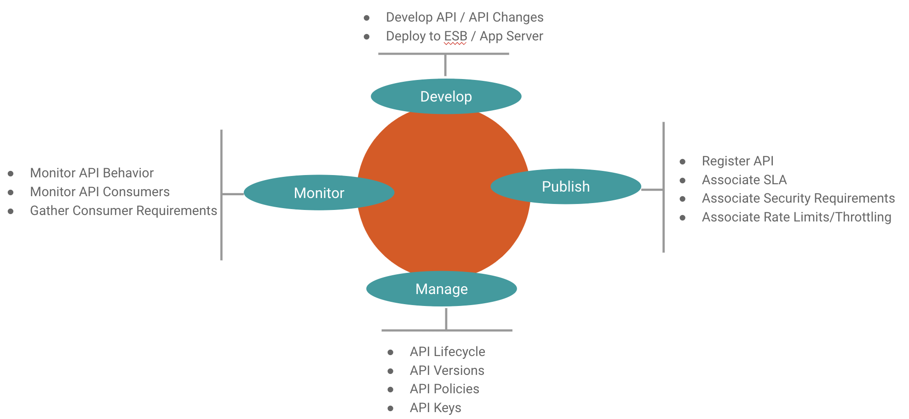
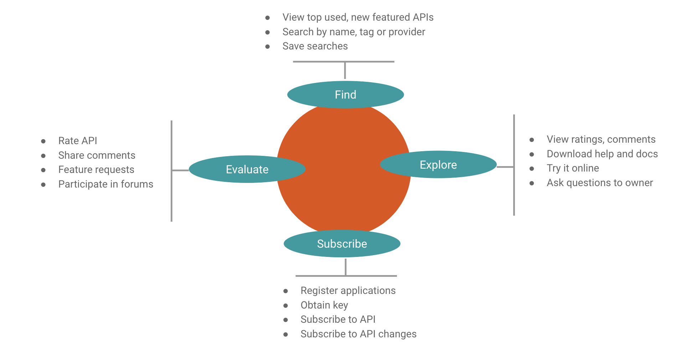

# Overview

In an age where organizations are becoming more and more "data-driven", exposing services & microservices via APIs is becoming the norm. These APIs are consumed by a wide range of devices for various day to day activities such as banking, shopping, smart solutions etc. In the recent past, the number of consumers, consuming these APIs have increased exponentially. This brings in new challenges for enterprises to deal with such as security of services,  maintaining APIs, managing APIs, enforcing policies etc. This is where an API Management solution is required. An API management solution manages the APIs by taking care of the exposure related complexities such as security, rate limiting, monitoring etc, while providing a platform to manage the APIs .

**The WSO2 API Manager is a high performant API Management solution** designed to solve this problem elegantly. It is the **only 100% open source** solution and comes with an [Apache Software License Version 2.0](http://www.apache.org/licenses/LICENSE-2.0) which makes it **free to use** .

## **What is the WSO2 API Manager** ?

In brief, the WSO2 API Manager consists of 6 main components, the [API Publisher,](_Design_API_) the [API developer Portal,](https://docs.wso2.com/display/SHAN/API+Developer+Portal) [API Gateway](_API_Gateway_) (now comes as a [API Microgateway](_API_Microgateway_) as well ), [Key Manager,](_API_Security_) [Traffic Manager](_Rate_Limiting_) and the [API Analytics](_Analytics_) . For more information on these components see [Architecture](https://docs.wso2.com/display/SHAN/Architecture) .

Some of the main features that the product offers is  design, prototype & publish APIs,  govern API use, enforce security and control access to APIs, manage and scale API Traffic, monitor and monetize APIs.  For more details please see [features.](https://wso2.com/api-management/features/)

## Key Features

-   Design and Prototype APIs

-   Manage and Scale API Traffic

-   Publish APIs and Govern API Use

-   Monitor and Monetize

-   Control Access and Enforce Security

-   Pluggable, Extensible, and Themeable

-   Developer Portal

-   Easily Deployable in Your Enterprise

-   Manage Developer Community

## Competitive Advantage

  <TO-DO>

## Basic Architecture and Key Components

The WSO2 API Manager consists of 6 main components, the [API Publisher,](https://docs.wso2.com/display/SHAN/API+Publisher) the [API developer Portal,](https://docs.wso2.com/display/SHAN/API+Developer+Portal) [API Gateway](https://docs.wso2.com/display/SHAN/API+Gateway) (now comes as a [API Microgateway](https://docs.wso2.com/display/SHAN/API+Microgateway) as well ), [Key Manager,](https://docs.wso2.com/display/SHAN/API+Security) [Traffic Manager](https://docs.wso2.com/display/SHAN/Rate+Limiting) and the [API Analytics](https://docs.wso2.com/display/SHAN/Analytics) . A component is made up of one or more [OSGi](http://www.osgi.org/Technology/Home) bundles. A bundle is the modularization unit in OSGi, similar to a JAR file in Java.

The component architecture of the WSO2 API Manager is illustrated in the diagram below.

-   #### API Publisher

API development is usually done by someone who understands the technical aspects of the API, interfaces, documentation, versions etc., while API management is typically carried out by someone who understands the business aspects of the APIs. In most business environments, API development is a responsibility that is distinct from API publication and management.

WSO2 API Manager provides a simple Web interface called **WSO2 API Publisher** for API development and management. It is a structured GUI designed for API creators to develop, document, scale and version APIs, while also facilitating more API management-related tasks such as publishing API, monetization, analyzing statistics, and promoting.

The API Publisher URL is **`                 https:                ` `                 //<YourHostName>:9443/publisher                `** and it is accessible on HTTPS only. The default credentials are admin/admin.

The diagram  shows the common lifecycle activities of an API developer/manager:

-   #### API Store (Developer Portal)

The API Store Web application provides a collaborative interface for API publishers to host and advertise their APIs and for API consumers to [self register](https://docs.wso2.com/display/AM260/Customizing+the+API+Store) , discover, evaluate, subscribe to and use secured, protected, authenticated APIs.

The API Store URL is **`                 https:                ` `                 //<YourHostName>:9443/store                `** and it is accessible on HTTPS only. The default credentials are admin/admin.

The diagram below shows common API consumer lifecycle activities:

-   #### API Gateway

A runtime, backend component (an [API proxy](https://docs.wso2.com/display/EI611/Working+with+APIs) ) developed using [WSO2 ESB](https://docs.wso2.com/display/EI611/WSO2+Enterprise+Integrator+Documentation) . API Gateway secures, protects, manages, and scales API calls. It intercepts API requests, applies policies such as throttling and security using handlers, and manages API statistics. Upon validation of a policy, the Gateway passes web service calls to the actual backend. If the service call is a token request, the Gateway passes it directly to the [Key Manager](#Overview-KeyManager) .
When WSO2 API Manager is running, you can access the Gateway using the following URL: <https://localhost:9443/carbon> . You integrate a monitoring and analytics component to the API Manager by [configuring WSO2 API Manager Analytics](https://docs.wso2.com/display/AM260/Configuring+APIM+Analytics) . This component provides reports, statistics and graphs on the APIs deployed in WSO2 API Manager. You can then configure alerts to monitor these APIs and detect unusual activity, manage locations via geo location statistics and, carry out detailed analysis of the logs.

!!! note
Although the API Gateway contains ESB features, it is recommended not to use it for ESB-specific tasks. Use it only for Gateway functionality related to API invocations. For example, if you want to call external services like SAP, use a separate [ESB cluster](https://docs.wso2.com/display/EI611/Clustering+the+ESB+Profile) for that purpose.

-   #### Key Manager

Manages all clients, security and access token-related operations. The Gateway connects with the Key Manager to check the validity of [OAuth](https://tools.ietf.org/html/rfc6749) tokens, subscriptions and API invocations. When a subscriber creates an application and generates an access token to the application using the API Store, the Store makes a call to the API Gateway, which in turn connects with the Key Manager to create an OAuth client and obtain an access token. Similarly, to validate a token, the API Gateway calls the Key Manager, which fetches and validates the token details from the database.

The Key Manager also provides a token API to generate OAuth tokens that can be accessed via the Gateway. All tokens used for validation are based on the OAuth 2.0.0 protocol. Secure authorization of APIs is provided by the OAuth 2.0 standard for key management. The API Gateway supports API authentication with OAuth 2.0, and enables IT organizations to enforce rate limits and throttling policies.

The Key Manager properly decouples the operations for creating OAuth applications and validating access tokens so that you can even plug in a third party-authorization server for key validations.

You can avoid making the Gateway connect with the Key Manager every time it receives an API invocation call, by enabling API Gateway [caching](https://docs.wso2.com/display/AM260/Configuring+Caching) . When caching is not enabled, a verification call happens every time the Gateway receives an API invocation call. For this verification, the Gateway passes an access token, the API, and API version to the Key Manager. Communication between the API Gateway and the Key Manager happens in either of the following ways:

-   Through a Web service call
-   Through a [Thrift](http://thrift.apache.org/static/files/thrift-20070401.pdf) call (Thrift is the default communication protocol and is much faster than SOAP over HTTP)

If your setup has a cluster of multiple Key Manager nodes that are fronted by a [load balancer](https://f5.com/glossary/load-balancer) that does not support Thrift, change the key management protocol from `                Thrift               ` to `                WSClient               ` using the `                <KeyValidatorClientType>               ` element in the `                <API-M_HOME>/repository/conf/api-manager.xml               ` file. Thrift uses [TCP](https://tools.ietf.org/html/rfc793) load balancing.

In a typical production environment, you can configure one of the following setups:

-   Configure a WSO2 API Manager instance as the Key Manager in a separate server. See [Product Profiles](https://docs.wso2.com/display/AM260/Product+Profiles) .
-   Configure an instance of WSO2 Identity Server as the Key Manager. See [Configuring WSO2 Identity Server as the Key Manager](https://docs.wso2.com/display/AM260/Configuring+WSO2+Identity+Server+as+the+Key+Manager) .
-   Configure a third-party authorization server for key validations and an API Manager instance for the rest of the key management operations. See [Configuring a Third-Party Key Manager](https://docs.wso2.com/display/AM260/Configuring+a+Third-Party+Key+Manager) .

-   #### Traffic Manager

The Traffic Manager helps users to regulate API traffic, make APIs and applications available to consumers at different service levels, and secure APIs against security attacks. The Traffic Manager features a dynamic throttling engine to process throttling policies in real-time, including rate limiting of API requests. For more information, see [Working with Throttling](https://docs.wso2.com/display/AM260/Working+with+Throttling) .

-   #### Analytics

Additionally, monitoring and analytics are provided by the analytics component, WSO2 API Manager Analytics. This component provides a host of statistical graphs and an  alerting mechanism on pre-determined events. For more information, see [Working with Analytics](https://docs.wso2.com/display/AM260/Working+with+Analytics) .
