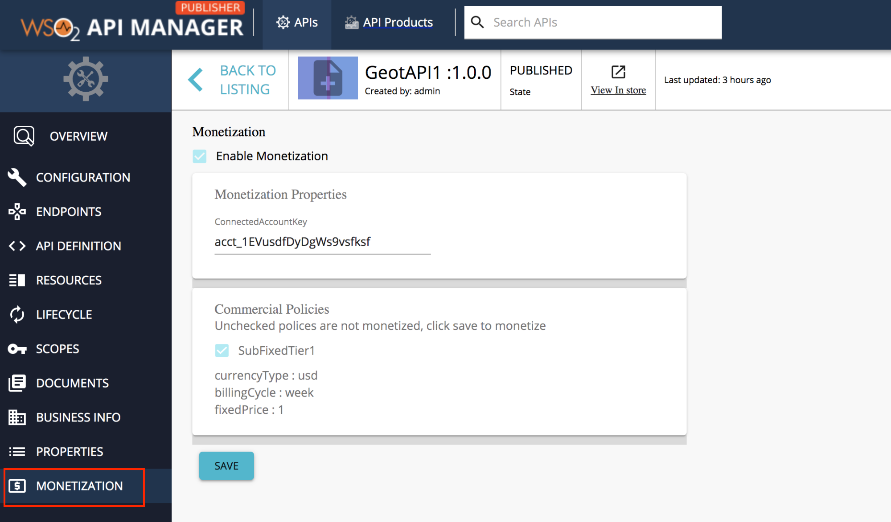
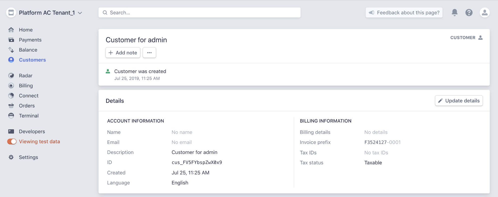
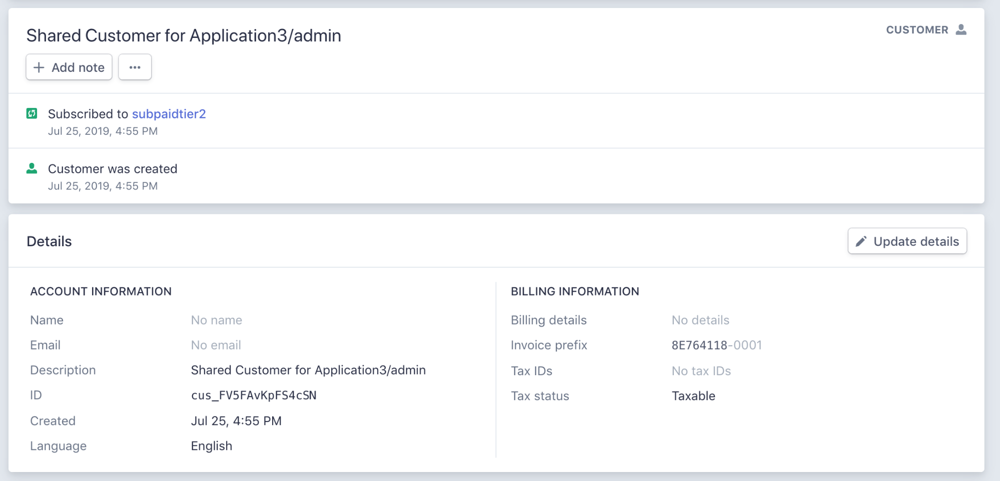
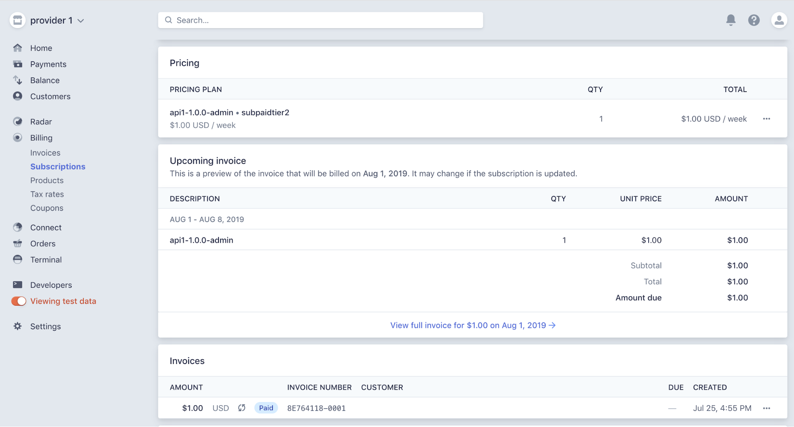
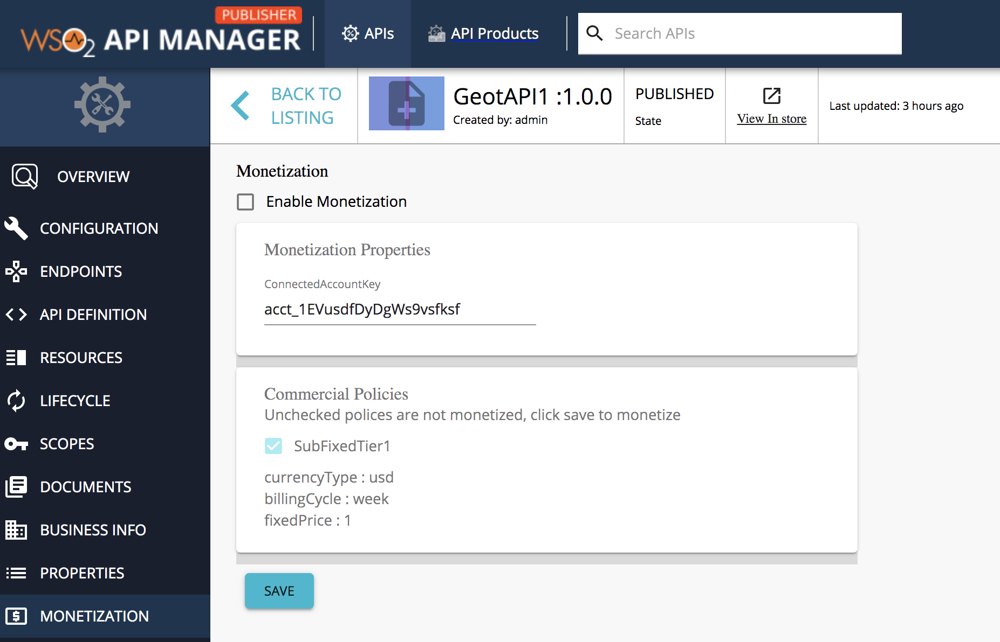

# Monetizing an API

API Monetization is the process that allows API publishers to earn money by charging developers for using their services that have been exposed as APIs. When using API Monetization, API publishers can select billing plans based on their requirements and API providers are able to maximize their revenue by selecting the most profitable pricing plan for their APIs.

WSO2 provides a API Monetization solution via WSO2 API Manager (WSO2 API-M) that allows you to generate revenue off your APIs based on your business
monetization goals. WSO2 API Manager provides an extendable interface that allows you to work with any third-party billing engine to monetize APIs using commercial tiers. 

WSO2 API Manager uses Stripe as its default billing engine for the purpose of demonstrating API monetization; however, you can plug in any custom implementation based on your requirement. WSO2 API Manager allows you to define various billing plans for the same service; therefore, subscribers have the freedom of selecting a suitable subscription for a billing plan based on their personal preferences. Overall, WSO2 API Manager allows you to manage, govern, and monetize APIs.

### Monetize an API

Let's use the
[wso2-am-stripe-plugin](https://github.com/wso2-extensions/wso2-am-stripe-plugin/blob/master/src/main/java/org.wso2.apim.monetization/impl/StripeMonetizationImpl.java) to monetize an API.

<html>
      <div class="admonition note">
      <p class="admonition-title">Note</p>
      <p>The following steps are based on the [Stripe billing engine](https://dashboard.stripe.com/). If you wish to work with another third-party billing engine, you need to first create a custom implementation by extending the <a href="https://github.com/wso2/carbon-apimgt/blob/master/components/apimgt/org.wso2.carbon.apimgt.api/src/main/java/org/wso2/carbon/apimgt/api/model/Monetization.java">monetization interface</a>, and only thereafter will you be able to monetize your API.</p>
      </div> 
</html>

#### Before you begin

##### (A.) - Configure the billing engine

1.  [Create an account in Stripe](https://dashboard.stripe.com/register) and obtain the keys for the tenant admin.
    1.  Create an account.  

         Use the details of the tenant admin and verify the account.

    2.  [Obtain the keys](https://stripe.com/docs/keys#api-keys).  

        
        
2.  Create an account in [Stripe](https://dashboard.stripe.com/register) and obtain the keys for the API provider.  
    
     Each API owner should create a Stripe account if they wish to monetize their APIs.

    1.  Create an account.
        <html>
        <div class="admonition note">
        <p class="admonition-title">Note</p>
        <p>Make sure to configure the <a href="https://dashboard.stripe.com/account">timezone to UTC</a> before creating any objects in the Stripe accounts.</p>
        </div> 
        </html>

    2.  [Obtain the keys](https://stripe.com/docs/keys#api-keys).

3.  Create a [connected account](https://stripe.com/docs/connect/quickstart#create-account) in Stripe.  
    
     Use the connected account to connect the API provider’s Stripe account to the tenant admin’s Stripe account. After you create the connected account, get the connect ID of the account, and save the details somewhere.


##### (B.) - Configure the billing engine with WSO2 API-M

1. Connect WSO2 API Manager to the billing engine.

    1. Download and copy the billing engine related JAR in to the `<API-M_HOME>/repository/components/lib` directory.
        
        For Stripe you need to add the [Stripe Java 9.8.0 JAR](https://mvnrepository.com/artifact/com.stripe/stripe-java/9.8.0).

    2. Build the implementation of the monetization interface and add the JAR in to the `<API-M_HOME>/repository/components/lib` directory.
        
        For Stripe you need to build the [wso2-am-stripe-plugin repository](https://github.com/wso2-extensions/wso2-am-stripe-plugin) and add the   `org.wso2.apim.monetization.impl-1.0-SNAPSHOT.jar` JAR.

    3.  Define the monetization implementation in WSO2 API Manager.
     
         Decompile the JAR that you get in the previous step and add the name of the package in the `<API-M_HOME>/repository/resources/conf/default.json` file as follows:

        ``` json tab="Format"
        "apim.monetization.monetization_impl": "<monetization-implementation>"
        ```

        ``` json tab="Example"
        "apim.monetization.monetization_impl": "org.wso2.apim.monetization.impl.StripeMonetizationImpl"
        ```

2.  Configure the database.
  
    1. Download and add the database related connector JAR in to the`<APIM_HOME/repository/components/lib` directory. 
        
        As a MySQL database is used for this scenario, download and copy the [MySQL connector
       JAR](https://mvnrepository.com/artifact/mysql/mysql-connector-java/5.1.36) to the `<APIM_HOME/repository/components/lib` directory.

    2. Configure the WSO2 API Manager related datasource.  
        
        Add the following configuration in the `<API-M_HOME>/repository/conf/deployment.toml` file under the `database.apim_db` section. Make sure to add the parameters based on your setup.

        ``` java
        [database.apim_db]
        type = "mysql"
        url = "jdbc:mysql://<DBHost>:<Port>/<DBName>?autoReconnect=true"
        username = "xxx"
        password = "yyy"
        defaultAutoCommit = "false"
        driverClassName = "com.mysql.jdbc.Driver"
        maxActive = "50"
        maxWait = "60000"
        testOnBorrow = "true"
        validationQuery = "SELECT 1"
        validationInterval = "30000"
        ```

    3.  Select the DB script based on the DB that you are working with from the `<API-M_HOME>/dbscripts/apimgt/` directory and execute it.
         
         As a MySQL database is used for this scenario, execute the `mysql5.7.sql` script.
         
    4.  Execute one of the following DB scripts in the `WSO2AM_DB` database, based on the DB that you are using.
         
         Execute the MySQL script in this scenario.
    
        ``` java tab="MySQL"
        CREATE TABLE IF NOT EXISTS AM_MONETIZATION (
            API_ID INTEGER NOT NULL,
            TIER_NAME VARCHAR(512),
            STRIPE_PRODUCT_ID VARCHAR(512),
            STRIPE_PLAN_ID VARCHAR(512),
            FOREIGN KEY (API_ID) REFERENCES AM_API (API_ID) ON DELETE CASCADE
        ) ENGINE=InnoDB;


        CREATE TABLE IF NOT EXISTS AM_POLICY_PLAN_MAPPING (
                POLICY_UUID VARCHAR(256),
                PRODUCT_ID VARCHAR(512),
                PLAN_ID VARCHAR(512),
                FOREIGN KEY (POLICY_UUID) REFERENCES AM_POLICY_SUBSCRIPTION(UUID)
        ) ENGINE=InnoDB;


        CREATE TABLE IF NOT EXISTS AM_MONETIZATION_PLATFORM_CUSTOMERS (
            ID INTEGER NOT NULL AUTO_INCREMENT,
            SUBSCRIBER_ID INTEGER NOT NULL,
            TENANT_ID INTEGER NOT NULL,
            CUSTOMER_ID VARCHAR(256) NOT NULL,    
            PRIMARY KEY (ID),
            FOREIGN KEY (SUBSCRIBER_ID) REFERENCES AM_SUBSCRIBER(SUBSCRIBER_ID) ON DELETE CASCADE
        ) ENGINE=InnoDB;


        CREATE TABLE IF NOT EXISTS AM_MONETIZATION_SHARED_CUSTOMERS (
            ID INTEGER NOT NULL AUTO_INCREMENT,
            APPLICATION_ID INTEGER NOT NULL,
            API_PROVIDER VARCHAR(256) NOT NULL,
            TENANT_ID INTEGER NOT NULL,
            SHARED_CUSTOMER_ID VARCHAR(256) NOT NULL,
            PARENT_CUSTOMER_ID INTEGER NOT NULL,    
            PRIMARY KEY (ID),
            FOREIGN KEY (APPLICATION_ID) REFERENCES AM_APPLICATION(APPLICATION_ID) ON DELETE CASCADE,
            FOREIGN KEY (PARENT_CUSTOMER_ID) REFERENCES AM_MONETIZATION_PLATFORM_CUSTOMERS(ID) ON DELETE CASCADE
        )ENGINE=INNODB;


        CREATE TABLE IF NOT EXISTS AM_MONETIZATION_SUBSCRIPTIONS (
            ID INTEGER NOT NULL AUTO_INCREMENT,
            SUBSCRIBED_APPLICATION_ID INTEGER NOT NULL,
            SUBSCRIBED_API_ID INTEGER NOT NULL,
            TENANT_ID INTEGER NOT NULL,
            SUBSCRIPTION_ID VARCHAR(256) NOT NULL,
            SHARED_CUSTOMER_ID INTEGER NOT NULL,    
            PRIMARY KEY (ID),
            FOREIGN KEY (SUBSCRIBED_APPLICATION_ID) REFERENCES AM_APPLICATION(APPLICATION_ID) ON DELETE CASCADE,
            FOREIGN KEY (SUBSCRIBED_API_ID) REFERENCES AM_API(API_ID) ON DELETE CASCADE,
            FOREIGN KEY (SHARED_CUSTOMER_ID) REFERENCES AM_MONETIZATION_SHARED_CUSTOMERS(ID) ON DELETE CASCADE
        )ENGINE INNODB;
        ```

        ``` java tab="DB2"
        CREATE TABLE IF NOT EXISTS AM_MONETIZATION (
            API_ID INTEGER NOT NULL,
            TIER_NAME VARCHAR(512),
            STRIPE_PRODUCT_ID VARCHAR(512),
            STRIPE_PLAN_ID VARCHAR(512),
            FOREIGN KEY (API_ID) REFERENCES AM_API (API_ID) ON DELETE CASCADE
        )/

        CREATE TABLE IF NOT EXISTS AM_POLICY_PLAN_MAPPING (
                POLICY_UUID VARCHAR(256),
                PRODUCT_ID VARCHAR(512),
                PLAN_ID VARCHAR(512),
                FOREIGN KEY (POLICY_UUID) REFERENCES AM_POLICY_SUBSCRIPTION(UUID)
        )/

        CREATE TABLE IF NOT EXISTS AM_MONETIZATION_PLATFORM_CUSTOMERS (
            ID INTEGER NOT NULL AUTO_INCREMENT,
            SUBSCRIBER_ID INTEGER NOT NULL,
            TENANT_ID INTEGER NOT NULL,
            CUSTOMER_ID VARCHAR(256) NOT NULL,    
            PRIMARY KEY (ID),
            FOREIGN KEY (SUBSCRIBER_ID) REFERENCES AM_SUBSCRIBER(SUBSCRIBER_ID) ON DELETE CASCADE
        )/

        CREATE TABLE IF NOT EXISTS AM_MONETIZATION_SHARED_CUSTOMERS (
            ID INTEGER NOT NULL AUTO_INCREMENT,
            APPLICATION_ID INTEGER NOT NULL,
            API_PROVIDER VARCHAR(256) NOT NULL,
            TENANT_ID INTEGER NOT NULL,
            SHARED_CUSTOMER_ID VARCHAR(256) NOT NULL,
            PARENT_CUSTOMER_ID INTEGER NOT NULL,    
            PRIMARY KEY (ID),
            FOREIGN KEY (APPLICATION_ID) REFERENCES AM_APPLICATION(APPLICATION_ID) ON DELETE CASCADE,
            FOREIGN KEY (PARENT_CUSTOMER_ID) REFERENCES AM_MONETIZATION_PLATFORM_CUSTOMERS(ID) ON DELETE CASCADE
        )/

        CREATE TABLE IF NOT EXISTS AM_MONETIZATION_SUBSCRIPTIONS (
            ID INTEGER NOT NULL AUTO_INCREMENT,
            SUBSCRIBED_APPLICATION_ID INTEGER NOT NULL,
            SUBSCRIBED_API_ID INTEGER NOT NULL,
            TENANT_ID INTEGER NOT NULL,
            SUBSCRIPTION_ID VARCHAR(256) NOT NULL,
            SHARED_CUSTOMER_ID INTEGER NOT NULL,    
            PRIMARY KEY (ID),
            FOREIGN KEY (SUBSCRIBED_APPLICATION_ID) REFERENCES AM_APPLICATION(APPLICATION_ID) ON DELETE CASCADE,
            FOREIGN KEY (SUBSCRIBED_API_ID) REFERENCES AM_API(API_ID) ON DELETE CASCADE,
            FOREIGN KEY (SHARED_CUSTOMER_ID) REFERENCES AM_MONETIZATION_SHARED_CUSTOMERS(ID) ON DELETE CASCADE
        )/
        ```

        ``` java tab="MSSQL"
        IF NOT  EXISTS (SELECT * FROM SYS.OBJECTS WHERE OBJECT_ID = OBJECT_ID(N'[DBO].[AM_MONETIZATION]') AND TYPE IN (N'U'))
        CREATE TABLE AM_MONETIZATION (
            API_ID INTEGER NOT NULL,
            TIER_NAME VARCHAR(512),
            STRIPE_PRODUCT_ID VARCHAR(512),
            STRIPE_PLAN_ID VARCHAR(512),
            FOREIGN KEY (API_ID) REFERENCES AM_API (API_ID) ON DELETE CASCADE
        );

        IF NOT  EXISTS (SELECT * FROM SYS.OBJECTS WHERE OBJECT_ID = OBJECT_ID(N'[DBO].[AM_POLICY_PLAN_MAPPING]') AND TYPE IN (N'U'))
        CREATE TABLE AM_POLICY_PLAN_MAPPING (
                POLICY_UUID VARCHAR(256),
                PRODUCT_ID VARCHAR(512),
                PLAN_ID VARCHAR(512),
                FOREIGN KEY (POLICY_UUID) REFERENCES AM_POLICY_SUBSCRIPTION(UUID)

        );

        IF NOT  EXISTS (SELECT * FROM SYS.OBJECTS WHERE OBJECT_ID = OBJECT_ID(N'[DBO].[AM_MONETIZATION_PLATFORM_CUSTOMERS]') AND TYPE IN (N'U'))
        CREATE TABLE AM_MONETIZATION_PLATFORM_CUSTOMERS (
            ID INTEGER NOT NULL AUTO_INCREMENT,
            SUBSCRIBER_ID INTEGER NOT NULL,
            TENANT_ID INTEGER NOT NULL,
            CUSTOMER_ID VARCHAR(256) NOT NULL,    
            PRIMARY KEY (ID),
            FOREIGN KEY (SUBSCRIBER_ID) REFERENCES AM_SUBSCRIBER(SUBSCRIBER_ID) ON DELETE CASCADE
        );

        IF NOT  EXISTS (SELECT * FROM SYS.OBJECTS WHERE OBJECT_ID = OBJECT_ID(N'[DBO].[AM_MONETIZATION_SHARED_CUSTOMERS]') AND TYPE IN (N'U'))
        CREATE TABLE AM_MONETIZATION_SHARED_CUSTOMERS (
            ID INTEGER NOT NULL AUTO_INCREMENT,
            APPLICATION_ID INTEGER NOT NULL,
            API_PROVIDER VARCHAR(256) NOT NULL,
            TENANT_ID INTEGER NOT NULL,
            SHARED_CUSTOMER_ID VARCHAR(256) NOT NULL,
            PARENT_CUSTOMER_ID INTEGER NOT NULL,    
            PRIMARY KEY (ID),
            FOREIGN KEY (APPLICATION_ID) REFERENCES AM_APPLICATION(APPLICATION_ID) ON DELETE CASCADE,
            FOREIGN KEY (PARENT_CUSTOMER_ID) REFERENCES AM_MONETIZATION_PLATFORM_CUSTOMERS(ID) ON DELETE CASCADE
        );

        IF NOT  EXISTS (SELECT * FROM SYS.OBJECTS WHERE OBJECT_ID = OBJECT_ID(N'[DBO].[AM_MONETIZATION_SUBSCRIPTIONS]') AND TYPE IN (N'U'))
        CREATE TABLE AM_MONETIZATION_SUBSCRIPTIONS (
            ID INTEGER NOT NULL AUTO_INCREMENT,
            SUBSCRIBED_APPLICATION_ID INTEGER NOT NULL,
            SUBSCRIBED_API_ID INTEGER NOT NULL,
            TENANT_ID INTEGER NOT NULL,
            SUBSCRIPTION_ID VARCHAR(256) NOT NULL,
            SHARED_CUSTOMER_ID INTEGER NOT NULL,    
            PRIMARY KEY (ID),
            FOREIGN KEY (SUBSCRIBED_APPLICATION_ID) REFERENCES AM_APPLICATION(APPLICATION_ID) ON DELETE CASCADE,
            FOREIGN KEY (SUBSCRIBED_API_ID) REFERENCES AM_API(API_ID) ON DELETE CASCADE,
            FOREIGN KEY (SHARED_CUSTOMER_ID) REFERENCES AM_MONETIZATION_SHARED_CUSTOMERS(ID) ON DELETE CASCADE
        );
        ```

        ``` java tab="Oracle"
        CREATE TABLE AM_MONETIZATION (
            API_ID INTEGER NOT NULL,
            TIER_NAME VARCHAR(512),
            STRIPE_PRODUCT_ID VARCHAR(512),
            STRIPE_PLAN_ID VARCHAR(512),
            FOREIGN KEY (API_ID) REFERENCES AM_API (API_ID) ON DELETE CASCADE
        )
        /

        CREATE TABLE AM_POLICY_PLAN_MAPPING (
                POLICY_UUID VARCHAR(256),
                PRODUCT_ID VARCHAR(512),
                PLAN_ID VARCHAR(512),
                FOREIGN KEY (POLICY_UUID) REFERENCES AM_POLICY_SUBSCRIPTION(UUID)
        )
        /

        CREATE TABLE AM_MONETIZATION_PLATFORM_CUSTOMERS (
            ID INTEGER NOT NULL AUTO_INCREMENT,
            SUBSCRIBER_ID INTEGER NOT NULL,
            TENANT_ID INTEGER NOT NULL,
            CUSTOMER_ID VARCHAR(256) NOT NULL,    
            PRIMARY KEY (ID),
            FOREIGN KEY (SUBSCRIBER_ID) REFERENCES AM_SUBSCRIBER(SUBSCRIBER_ID) ON DELETE CASCADE
        )
        /

        CREATE TABLE AM_MONETIZATION_SHARED_CUSTOMERS (
            ID INTEGER NOT NULL AUTO_INCREMENT,
            APPLICATION_ID INTEGER NOT NULL,
            API_PROVIDER VARCHAR(256) NOT NULL,
            TENANT_ID INTEGER NOT NULL,
            SHARED_CUSTOMER_ID VARCHAR(256) NOT NULL,
            PARENT_CUSTOMER_ID INTEGER NOT NULL,    
            PRIMARY KEY (ID),
            FOREIGN KEY (APPLICATION_ID) REFERENCES AM_APPLICATION(APPLICATION_ID) ON DELETE CASCADE,
            FOREIGN KEY (PARENT_CUSTOMER_ID) REFERENCES AM_MONETIZATION_PLATFORM_CUSTOMERS(ID) ON DELETE CASCADE
        )
        /

        CREATE TABLE AM_MONETIZATION_SUBSCRIPTIONS (
            ID INTEGER NOT NULL AUTO_INCREMENT,
            SUBSCRIBED_APPLICATION_ID INTEGER NOT NULL,
            SUBSCRIBED_API_ID INTEGER NOT NULL,
            TENANT_ID INTEGER NOT NULL,
            SUBSCRIPTION_ID VARCHAR(256) NOT NULL,
            SHARED_CUSTOMER_ID INTEGER NOT NULL,    
            PRIMARY KEY (ID),
            FOREIGN KEY (SUBSCRIBED_APPLICATION_ID) REFERENCES AM_APPLICATION(APPLICATION_ID) ON DELETE CASCADE,
            FOREIGN KEY (SUBSCRIBED_API_ID) REFERENCES AM_API(API_ID) ON DELETE CASCADE,
            FOREIGN KEY (SHARED_CUSTOMER_ID) REFERENCES AM_MONETIZATION_SHARED_CUSTOMERS(ID) ON DELETE CASCADE
        )
        /
        ```

        ``` java tab="Oracle Rac"
        CREATE TABLE AM_MONETIZATION (
            API_ID INTEGER NOT NULL,
            TIER_NAME VARCHAR(512),
            STRIPE_PRODUCT_ID VARCHAR(512),
            STRIPE_PLAN_ID VARCHAR(512),
            FOREIGN KEY (API_ID) REFERENCES AM_API (API_ID) ON DELETE CASCADE
        )
        /

        CREATE TABLE AM_POLICY_PLAN_MAPPING (
                POLICY_UUID VARCHAR(256),
                PRODUCT_ID VARCHAR(512),
                PLAN_ID VARCHAR(512),
                FOREIGN KEY (POLICY_UUID) REFERENCES AM_POLICY_SUBSCRIPTION(UUID)
        )
        /

        CREATE TABLE AM_MONETIZATION_PLATFORM_CUSTOMERS (
            ID INTEGER NOT NULL AUTO_INCREMENT,
            SUBSCRIBER_ID INTEGER NOT NULL,
            TENANT_ID INTEGER NOT NULL,
            CUSTOMER_ID VARCHAR(256) NOT NULL,    
            PRIMARY KEY (ID),
            FOREIGN KEY (SUBSCRIBER_ID) REFERENCES AM_SUBSCRIBER(SUBSCRIBER_ID) ON DELETE CASCADE
        )
        /

        CREATE TABLE AM_MONETIZATION_SHARED_CUSTOMERS (
            ID INTEGER NOT NULL AUTO_INCREMENT,
            APPLICATION_ID INTEGER NOT NULL,
            API_PROVIDER VARCHAR(256) NOT NULL,
            TENANT_ID INTEGER NOT NULL,
            SHARED_CUSTOMER_ID VARCHAR(256) NOT NULL,
            PARENT_CUSTOMER_ID INTEGER NOT NULL,    
            PRIMARY KEY (ID),
            FOREIGN KEY (APPLICATION_ID) REFERENCES AM_APPLICATION(APPLICATION_ID) ON DELETE CASCADE,
            FOREIGN KEY (PARENT_CUSTOMER_ID) REFERENCES AM_MONETIZATION_PLATFORM_CUSTOMERS(ID) ON DELETE CASCADE
        )
        /

        CREATE TABLE AM_MONETIZATION_SUBSCRIPTIONS (
            ID INTEGER NOT NULL AUTO_INCREMENT,
            SUBSCRIBED_APPLICATION_ID INTEGER NOT NULL,
            SUBSCRIBED_API_ID INTEGER NOT NULL,
            TENANT_ID INTEGER NOT NULL,
            SUBSCRIPTION_ID VARCHAR(256) NOT NULL,
            SHARED_CUSTOMER_ID INTEGER NOT NULL,    
            PRIMARY KEY (ID),
            FOREIGN KEY (SUBSCRIBED_APPLICATION_ID) REFERENCES AM_APPLICATION(APPLICATION_ID) ON DELETE CASCADE,
            FOREIGN KEY (SUBSCRIBED_API_ID) REFERENCES AM_API(API_ID) ON DELETE CASCADE,
            FOREIGN KEY (SHARED_CUSTOMER_ID) REFERENCES AM_MONETIZATION_SHARED_CUSTOMERS(ID) ON DELETE CASCADE
        )
        /
        ```

        ``` java tab="Postgre"
            CREATE SEQUENCE AM_MONETIZATION START WITH 1 INCREMENT BY 1;
            CREATE TABLE IF NOT EXISTS AM_POLICY_SUBSCRIPTION (
                API_ID INTEGER NOT NULL,
                TIER_NAME VARCHAR(512),
                STRIPE_PRODUCT_ID VARCHAR(512),
                STRIPE_PLAN_ID VARCHAR(512),
                FOREIGN KEY (API_ID) REFERENCES AM_API (API_ID) ON DELETE CASCADE
            );
        
            CREATE SEQUENCE AM_POLICY_PLAN_MAPPING START WITH 1 INCREMENT BY 1;
            CREATE TABLE IF NOT EXISTS AM_POLICY_SUBSCRIPTION (
                    POLICY_ID INTEGER DEFAULT NEXTVAL('AM_POLICY_PLAN_MAPPING'),
                    POLICY_UUID VARCHAR(256),
                    PRODUCT_ID VARCHAR(512),
                    PLAN_ID VARCHAR(512),
                    FOREIGN KEY (POLICY_UUID) REFERENCES AM_POLICY_SUBSCRIPTION(UUID)
        
            );
        
            CREATE SEQUENCE AM_MONETIZATION_PLATFORM_CUSTOMERS START WITH 1 INCREMENT BY 1;
            CREATE TABLE IF NOT EXISTS AM_POLICY_SUBSCRIPTION (
                        POLICY_ID INTEGER DEFAULT NEXTVAL('AM_MONETIZATION_PLATFORM_CUSTOMERS'),
                ID INTEGER NOT NULL AUTO_INCREMENT,
                SUBSCRIBER_ID INTEGER NOT NULL,
                TENANT_ID INTEGER NOT NULL,
                CUSTOMER_ID VARCHAR(256) NOT NULL,    
                PRIMARY KEY (ID),
                FOREIGN KEY (SUBSCRIBER_ID) REFERENCES AM_SUBSCRIBER(SUBSCRIBER_ID) ON DELETE CASCADE
            );
        
            CREATE SEQUENCE AM_MONETIZATION_SHARED_CUSTOMERS START WITH 1 INCREMENT BY 1;
            CREATE TABLE IF NOT EXISTS AM_POLICY_SUBSCRIPTION (
                        POLICY_ID INTEGER DEFAULT NEXTVAL('AM_MONETIZATION_SHARED_CUSTOMERS'),
                ID INTEGER NOT NULL AUTO_INCREMENT,
                APPLICATION_ID INTEGER NOT NULL,
                API_PROVIDER VARCHAR(256) NOT NULL,
                TENANT_ID INTEGER NOT NULL,
                SHARED_CUSTOMER_ID VARCHAR(256) NOT NULL,
                PARENT_CUSTOMER_ID INTEGER NOT NULL,    
                PRIMARY KEY (ID),
                FOREIGN KEY (APPLICATION_ID) REFERENCES AM_APPLICATION(APPLICATION_ID) ON DELETE CASCADE,
                FOREIGN KEY (PARENT_CUSTOMER_ID) REFERENCES AM_MONETIZATION_PLATFORM_CUSTOMERS(ID) ON DELETE CASCADE
            );
        
            CREATE SEQUENCE AM_MONETIZATION_SUBSCRIPTIONS START WITH 1 INCREMENT BY 1;
            CREATE TABLE IF NOT EXISTS AM_POLICY_SUBSCRIPTION (
                        POLICY_ID INTEGER DEFAULT NEXTVAL('AM_MONETIZATION_SUBSCRIPTIONS'),
                ID INTEGER NOT NULL AUTO_INCREMENT,
                SUBSCRIBED_APPLICATION_ID INTEGER NOT NULL,
                SUBSCRIBED_API_ID INTEGER NOT NULL,
                TENANT_ID INTEGER NOT NULL,
                SUBSCRIPTION_ID VARCHAR(256) NOT NULL,
                SHARED_CUSTOMER_ID INTEGER NOT NULL,    
                PRIMARY KEY (ID),
                FOREIGN KEY (SUBSCRIBED_APPLICATION_ID) REFERENCES AM_APPLICATION(APPLICATION_ID) ON DELETE CASCADE,
                FOREIGN KEY (SUBSCRIBED_API_ID) REFERENCES AM_API(API_ID) ON DELETE CASCADE,
                FOREIGN KEY (SHARED_CUSTOMER_ID) REFERENCES AM_MONETIZATION_SHARED_CUSTOMERS(ID) ON DELETE CASCADE
            );
        ```

    6.  Configure the tenant admin on WSO2 API Manager.
        1.  Start the WSO2 API Manager server.
        2.  Sign in to the WSO2 API-M management console.
        3.  Add the following configuration in
            `tenant-conf.json` (`/_system/config/apimgt/applicationdata/tenant-conf.json`) file using the management console.  

            ``` json tab="Format"
            "MonetizationInfo": {
                "<key-value-pair>"
            }
            ```

             * `<key-value-pair>` - The key value pair varies based on your monetization interface. There can be multiple key value pairs.

            ``` json tab="Example"
            "MonetizationInfo": {
                "BillingEnginePlatformAccountKey": "sk_test_QEGKUR7yt83Bc0RdAme0bZPL00hnxaNCE6"
            }
            ```

             * `sk_test_QEGKUR7yt83Bc0RdAme0bZPL00hnxaNCE6` - In the case of Stripe this is the platform account key that corresponds to the tenant admin, which you obtained after creating the Stripe account for tenant admin.

    7. Optionally, change the granularity for data aggregation if required.

        1.  Navigate to the `<API-M_HOME>/repository/conf/deployment.toml` file.
        2.  Add the following configuration in the TOML file. 

            ``` java
            "apim.monetization.granularity": "seconds" 
            ```

##### (C.) - Configure the billing engine with WSO2 API-M Analytics
When working with API Monetization, it is mandatory to enable WSO2 API Manager Analytics, because WSO2 API Manager needs to fetch API usage from analytics.

1.  Enable WSO2 API Manager Analytics.  
    
     You need to enable WSO2 API Manager Analytics in order to use Monetization, because when working with Monetization the API usage is derived from WSO2 API Manager Analytics.  
     
     <html>
     <p>
     Copy the <a href="https://raw.githubusercontent.com/wso2/analytics-solutions/master/features/apim-analytics-feature/org.wso2.analytics.solutions.apim.analytics.feature/src/main/resources/monetization-summary-siddhi-file/APIM_MONETIZATION_SUMMARY.siddhi">APIM_MONETIZATION_SUMMARY.siddhi</a>
    file and add it in to the <code><API-M-ANALYTICS_HOME>/wso2/worker/deployment/siddhi-files</code> directory if it is not already available.
    </p>
    </html>

2.  Configure the workflows.  

     You need to do this in order to ensure that the correct workflows are engaged when a subscription is added or removed.

     1.  Sign in to the WSO2 API-M management console.
     2.  Edit the workflow executors in the `workflow-extensions.xml` (`/_system/governance/apimgt/applicationdata/workflow-extensions.xml`) file.
        
    ``` xml tab="Format"
    <SubscriptionCreation executor="<billing-engine-related-SubscriptionCreationWorkflowExecutor>"/>
    <SubscriptionDeletion executor="<billing-engine-related-StripeSubscriptionDeletionWorkflowExecutor>"/> 
    ```

    ``` xml tab="Example"
    <SubscriptionCreation executor="org.wso2.apim.monetization.impl.workflow.StripeSubscriptionCreationWorkflowExecutor"/>
    <SubscriptionDeletion executor="org.wso2.apim.monetization.impl.workflow.StripeSubscriptionDeletionWorkflowExecutor"/>
    ```

#### Step 1 - Create a subscription tier

1.  Navigate to the WSO2 API Manager admin dashboard.  
     
     `https://<API-M_host>:<port>/admin`

2.  Create a subscription policy.  
     
     Specify the monetization plan and other relevant data based on your preference. For more information, see [Adding a new subscription-level throttling tier](../../Learn/RateLimiting/adding-new-throttling-policies#Adding-a-new-subscription---level-throttling-tier).

     <html>
      <div class="admonition note">
      <p class="admonition-title">Note</p>
      <p>When using Stripe as a billing engine it only allows you to create monetization plans for commercial tiers. Therefore, as Stripe is the billing engine in this example, make sure to create a subscription policy that has a commercial tier.</p>
      </div> 
     </html>


     <html>
         <head>
         </head>
         <body>
             
         </body>
     </html>

     After you save the policy, a plan gets created in the Stripe account of the tenant admin.  

       
     
     The newly created Stripe product ID and plan ID will be stored in `AM_POLICY_PLAN_MAPPING` table along with the `UUID` of the tier. When you update the details of this tier, the plan in Stripe will get updated with the corresponding details. Likewise, when you delete this tier, the plan in Stripe will get deleted and the corresponding record in the DB will also get deleted.

#### Step 2 - Enable monetization

1.  <a name> additionalProp </a> Configure the additional properties that are specific to the billing engine with regard to monetization in WSO2 API Manager.  
     
     After saving these configurations, the properties get populated in the Monetization enable/disable page on the Publisher in WSO2 API Manager.  

    1.  Add the following configuration under Monetization in the `<API-M_HOME>/repository/resources/conf/templates/repository/conf/api-manager.xml.j2` file.

        ``` java
        <AdditionalProperties>
        
                <Property>{{origin}}</Property>
        
        </AdditionalProperties>

        
                    <AdditionalAttributes>
                        
                        <Attribute required="{{attribute.required}}">
                            <Name>{{attribute.name}}</Name>
                            <DisplayName>{{attribute.display_name}}</DisplayName>
                            <Description>{{attribute.description}}</Description>
                            <Default>{{attribute.default}}</Default>
                        </Attribute>
                        
                    </AdditionalAttributes>
        
        ```

    2.  Add the following configuration in the `<API-M_HOME>/repository/conf/deployment.toml` file.

        ``` java
        [apim.monetization]
        additional_attributes=['ConnectedAccountKey']
        ```

        When using Stripe as the billing engine, you need to enter the connect ID, which is the ID that indicates the link between the tenant admin and API provider Stripe accounts.

2.  Enable API monetization.

    1.  Sign in to the WSO2 API Manager Publisher.  
        `https://<hostname>:9443/publisher-new`
    2.  Click on the API that you wish to monetize.  
        
    3.  Click **Monetization** to go to the Monetization configurations.
    4.  Enter the connect ID as the connected account key and click
        **Save**.  
         
         This creates the products and plans in Stripe based on the commercial tiers attached to the API.

#### Step 3 - Subscribe to a monetized API

[Subscribe to an API](../../Learn/Tutorials/subscribe-to-an-api) and invoke the API. When subscribing to an API, the price of the tier and billing plan is shown. Therefore, the Subscriber can select an appropriate plan and subscribe to it. 

At the time of subscribing to an API, a Stripe customer is created in the Stripe platform account (e.g., the Stripe account for tenant admin). The following screenshot shows the customer record in the platform Stripe account.


The following screenshot depicts the details of the newly created customer in the platform Stripe account.



Thereafter, the customer will be copied to the Stripe account of the API
provider, which is the connected account.


The following are the details of the shared customer that appears in the
Stripe UI.



A Stripe subscription will be created in the billing engine by fetching the details specified in the Stripe plan, which is associated with the subscription tier.

#### Step 4 - Send usage data to the billing engine

You can use the admin API that is available in WSO2 API Manager to publish the summarized data to Stripe. After this API call takes place, it pushes the usage data to Stripe. After Stripe gets the usage data, it will check for the subscriptions that are completing their billing cycle and charge the customer accordingly.

1.  Obtain the consumer key and secret key pair by calling the dynamic client registration endpoint.  
     
     For more information, see [Admin REST API - Getting Started](https://docs.wso2.com/display/AM260/apidocs/admin/index.html#guide).

    ``` java
    curl -X POST -H "Authorization: Basic <base64encoded-admin-account-credentials>" -H "Content-Type: application/json" -d @payload.json https://localhost:9443/client-registration/v0.14/register
    ```

    -   `<base64encoded-admin-account-credentials>` - Use a base64 encoder (e.g., <https://www.base64encode.org/> ) to encode the username and password       that corresponds to your admin user account using the following format: 
        
        `<username>:<password>` 
        
        Thereafter, enter the encoded value as this parameter.

2.  Obtain a token with the monetization usage scope (`scope apim:monetization_usage_publish`).

    ``` java
    curl -X POST https://localhost:8243/token -H 'Authorization: Basic <base64encoded-registeration-credentials>' -d 'grant_type=password&username=admin&password=admin&scope=apim:monetization_usage_publish'
    ```
      
    -   `<base64encoded-registeration-credentials>` - Use a base64 encoder (e.g., <https://www.base64encode.org/>) to encode the username and password          that corresponds to the client ID and client secret that you received as the response in the previous step using the following format: 
    
        `<clientID>:<clientSecret>` 
    
        Thereafter, enter the encoded value as this parameter.

3.  Publish usage data to the Stripe billing engine.

    ``` java
    curl -k -H "Authorization: Bearer <monetization-usage-publish-token>" -X POST -H "Content-Type: application/json" https://localhost:9443/api/am/admin/v0.14/monetization/publish-usage
    ```

    -   `<monetization-usage-publish-token>` - This is the token that you got when you executed the Admin REST API with the monetization usage scope.

    The REST API response is as follows:

    ``` java
    {"status":"Request Accepted","message":"Server is running the usage publisher"}
    ```

    The aggregation count will be stored in `ApiPerDestinationAgg_SECONDS` table, which corresponds to the WSO2 API-M Analytics database. If you check the `AM_MONETIZATION_USAGE_PUBLISHER` table after the admin API call is made, you will see that the record for the API usage is published.  
      
    In addition, after the admin API call is made the aggregated bill
    gets generated in Stripe (connected account).  
     At the end of
    the billing cycle, the amount will be charged from the customer. As
    this scenario uses a usage based billing model, the revenue goes from the subscriber to the API provider in the billing engine.

#### Step 5 - Monitor usage of a monetized API

There are two types of billing plans for monetized APIs, namely the fixed billing plan and the dynamic billing plan. Usage needs to be monitored for APIs associated with dynamic billing plans, which is also referred to as metered billing. 

When an API request is initiated, the API Gateway will publish the analytics related to that request. The successful API calls is recorded in the database and this data is used to aggregate the API usage and charge from the subscriber.

##### View the revenue for a particular subscription in a given API

If a subscription is based on metered billing it is possible to get the revenue up-to now, which is within the current billing cycle. Subscriptions with a fixed amount is not counted here.

##### View the revenue for a given API from all subscriptions

This refers to the revenue related to the aggregation of all metered billing subscriptions. The API provider can use this chart to get an idea of the total revenue up-to now for each subscription.

### Disable monetization

Follow the instructions below to disable monetization for an API:

<html>
      <div class="admonition note">
      <p class="admonition-title">Note</p>
      <p>It is assumed that you have already [configured the additional properties](../../Learn/APIMonetization/monetizing-an-api#additionalProp) that are specific to the billing engine with regard to monetization in WSO2 API Manager.</p>
      </div> 
</html>

1.  Sign in to the WSO2 API Manager Publisher.  
    `https://<hostname>:9443/publisher-new`
2.  Click on the monetized API.
3.  Click **Monetization** to go to the Monetization configurations.  
    
4.  Click **Enable Monetization** to unselect the enable monetization option.
5.  Enter the connect ID as the connected account key.
6.  Click **Save**.  
    
     The products and plans are removed in the Stripe billing engine based on the commercial tiers attached to the API.

