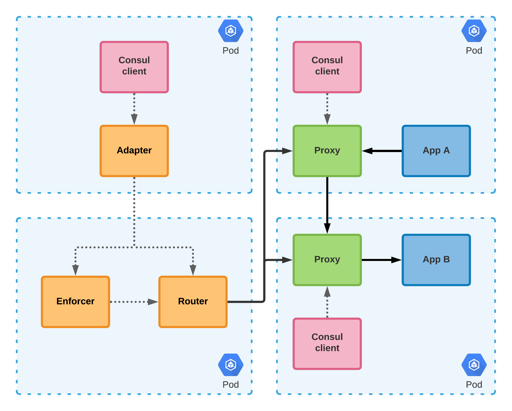

# Configure Choreo Connect with Consul service mesh deployed on Kubernetes
Example:



## Step 1 - Deploy Consul on K8s
Deploy Consul using the [official Helm Chart](https://helm.releases.hashicorp.com/).<br>
For more instructions, see the [Consul official documentation](https://www.consul.io/docs/k8s).
## Step 2 - Modify Choreo Connect k8s artifacts 
Add the `'consul.hashicorp.com/connect-inject': 'true'` annotation to Adapter's deployment spec
```yaml
apiVersion: apps/v1
kind: Deployment
metadata:
  name: choreo-connect-adapter
spec:
  replicas: 1
  selector:
    matchLabels:
      app: choreo-connect-adapter
  template:
    metadata:
      labels:
        app: choreo-connect-adapter
      annotations:
        'consul.hashicorp.com/connect-inject': 'true'
```
In the config.toml config map, go to the \[adapter.consul] section and update it's `url` with k8s node ip.
<!-- TODO  How to find the node-ip? -->
<!-- TODO  How to find the acl token? -->
<!-- TODO  How to find the initial certs? -->
```
[adapter.consul]
  enable = true
  url = "http://<node-ip>:8500"
  pollInterval = 5
  aclToken = "d3a2a719-4221-8c65-5212-58d4727427ac"
  mgwServiceName = "choreo-connect"
  serviceMeshEnabled = true
  caCertFile = "/home/wso2/security/truststore/consul/consul-agent-ca.pem"
  certFile = "/home/wso2/security/truststore/consul/local-dc-client-consul-0.pem"
  keyFile = "/home/wso2/security/truststore/consul/local-dc-client-consul-0-key.pem"
```
Apply the k8s artifacts for Choreo Connect.

## Step 3 - Deploy the API
Deploy WSO2 API Manger on Kubernetes.<br>
Using the API Manager, deploy your API as described in [how to define the endpoints](../service-discovery/#how-to-define-the-endpoints) guide.