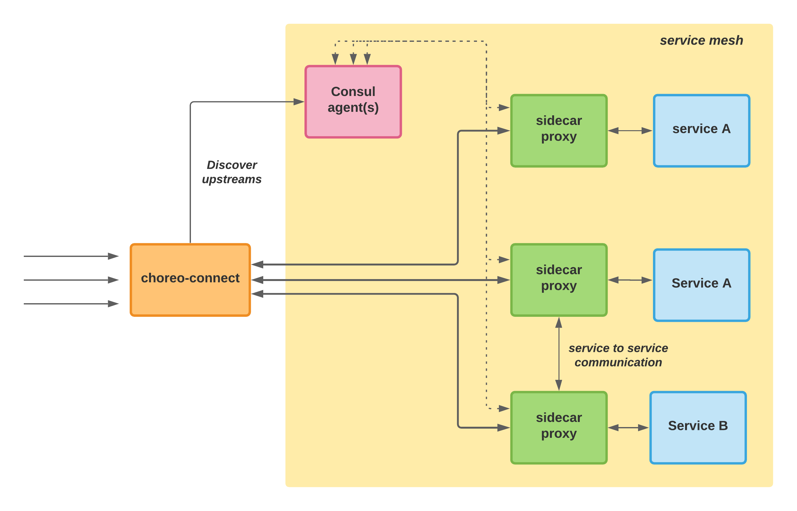

# Configure Choreo Connect with Consul service mesh
Example:



## Step 1 - Setup Consul
Set up Consul securely.<br>
For more instructions, see the [Consul official documentation](https://www.consul.io/docs).
## Step 2 - Add Choreo Connect as a native service in Consul
You can use the Consul HTTP API to add Choreo Connect as a native service.
Example Request:
```shell
curl \
--request PUT \
--data @payload.json \
http://169.254.1.1:8500/v1/agent/service/register?replace-existing-checks=true
```
Example payload file:
```json
{
  "service": {
    "id": "choreo-connect-1",
    "name": "choreo-connect",
    "tags": [
      "wso2",
      "production"
    ],
    "connect": {
      "native": true
    },
    "token": "521059b1-66fd-7e25-7824-2597b8b712d9"
  }
}
```
For more information refer [Consul HTTP API](https://www.consul.io/api-docs/agent/service#register-service)

## Step 3 - Configure Choreo Connect
Refer to the Adapter section to the main configuration file of Choreo Connect (`config.toml` file). 
```
[adapter.consul]
  enable = true
  url = "https://169.254.1.1:8501"
  pollInterval = 5
  aclToken = "d3a2a719-4221-8c65-5212-58d4727427ac"
  mgwServiceName = "choreo-connect"
  serviceMeshEnabled = true
  caCertFile = "/home/wso2/security/truststore/consul/consul-agent-ca.pem"
  certFile = "/home/wso2/security/truststore/consul/local-dc-client-consul-0.pem"
  keyFile = "/home/wso2/security/truststore/consul/local-dc-client-consul-0-key.pem"
```
Make sure the property `serviceMeshEnabled` is set to `true`.
Then start Choreo Connect.

## Step 4 - Deploy the API
You can use either WSO2 API Manager or APICTL to deploy APIs as described in []()