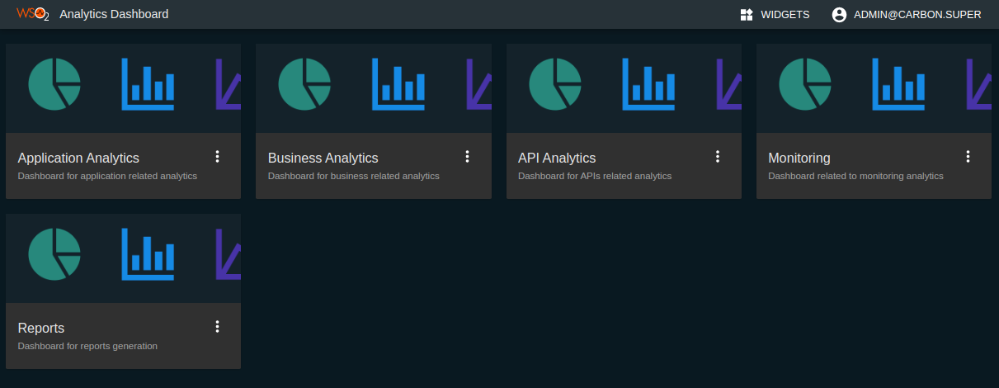
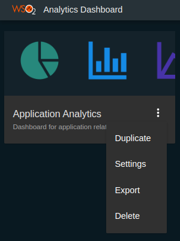

# Managing Analytics Dashboard Permissions

From API-M Analytics 3.0.0 release onwards, Publisher and Developer Portal statistics are moved out from the Publisher and Developer portal apps.
And those can be viewed using the **dashboard** runtime of the API-M Analytics server.

This section explains about managing permissions of each of these dashboards.

## Permission Levels of a Dashboard
A dashboard has three levels of permissions.

+ **Owners** - Owners of a dashboard are the most privileged users of the dashboard. Only they have access to settings page once access control is set. They also can edit or view the dashboard.
+ **Editors** - Editors of a dashboard can either edit the dashboard or view the dashboard. Editing the dashboard includes adding / removing widgets, add / remove pages to the dashboard, changing the layout of the dashboard etc. 
But they don’t have access to the dashboard settings page.
+ **Viewers** - Viewers of a dashboard are the least privileged users of a dashboard. The can only view the dashboard and cannot edit or change the settings of a dashboard.

## Configuring Dashboard Permissions
Now let's see how we can change the default permissions that is set for each of these dashboards.

+ Log in to the Analytics Dashboard by accessing `<Protocol>://<Host>:<Port>/analytics-dashboard` (ex: [https://localhost:9643/analytics-dashboard](https://localhost:9643/analytics-dashboard)). 
+ After login in, you will see the **APIM Publisher** and the **APIM Developer Portal** dashboards listed.
  
       

+ Click on the three dots at the bottom right corner of the preferred dashboard card and select **Settings**

       
     
!!! Note
      Settings option will be visible only if you have owner permission of the selected dashboard.
      
+ The Dashboard Settings page opens and you can assign scopes for different permission levels.

      
      
!!! Info
      List of available scopes will be populated for each permission level. Dashboard owners can set the required scopes for each of those permission levels. Each permission level can have multiple scopes.

## Permission Delegation to Users

A set of user roles need to be assigned when [creating a user](https://apim.docs.wso2.com/en/latest/administer/product-administration/managing-users-and-roles/managing-users/#adding-a-new-user). Each role has a set of scopes permitted to that. Based on the assigned roles the scopes which are permitted to the user can be found using the `RESTAPIScopes` value of `APIM_HOME/repository/resources/tenant-conf.json` file.

If it is required to add a new role and provide some `RESTAPIScopes` then that can be done, either [modifying the tenant-conf.json](https://apim.docs.wso2.com/en/latest/administer/product-administration/managing-users-and-roles/managing-user-roles/#create-user-roles) or using the APIM Admin Portal as well.

When a user logging into the analytics dashboard, will be given a permission level out of the three described above, comparing the scopes to the user’s role set and scopes to each permission level.

For example, when creating a user hoping to provide the ‘Viewer’ permission to a dashboard following factors should be considered.

1. The user’s role set should contain all the `RESTAPIScopes` assigned to the `Viewer` permission.
2. All the `RESTAPIScopes` assigned to `Viewer` permission should have been configured in the `ANALYTICS_HOME/conf/dashboard/deployment.yaml` as follows.

```yaml
   auth.configs:
     properties:
       allScopes: apim_analytics:admin apim_analytics:product_manager apim_analytics:api_developer apim_analytics:app_developer apim_analytics:devops_engineer apim_analytics:analytics_viewer apim_analytics:everyone openid apim:api_view apim:subscribe
```   
