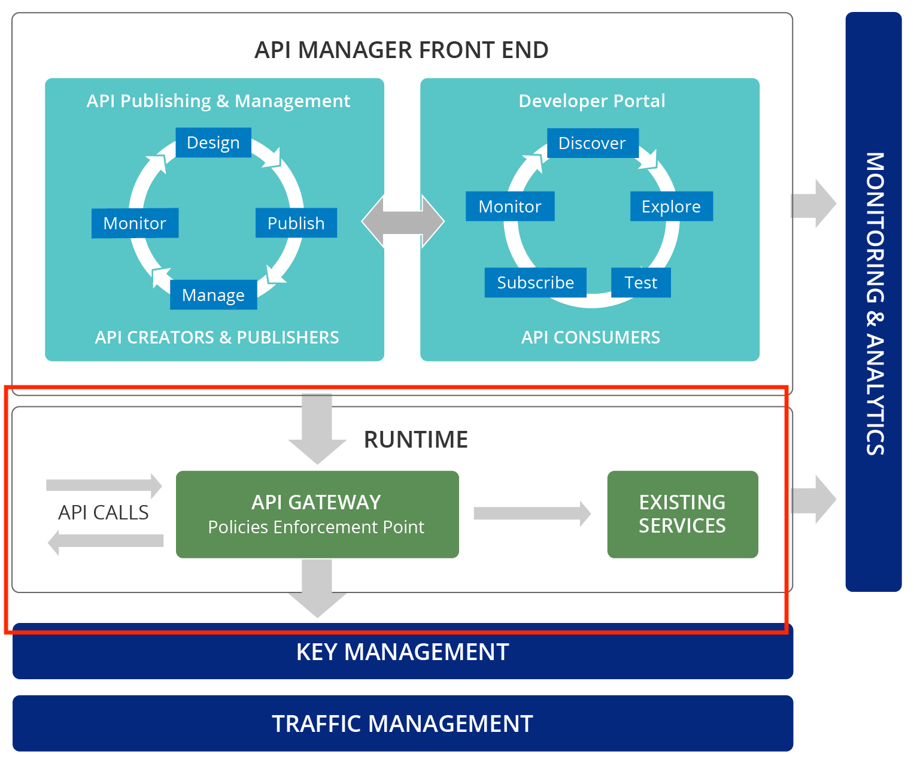
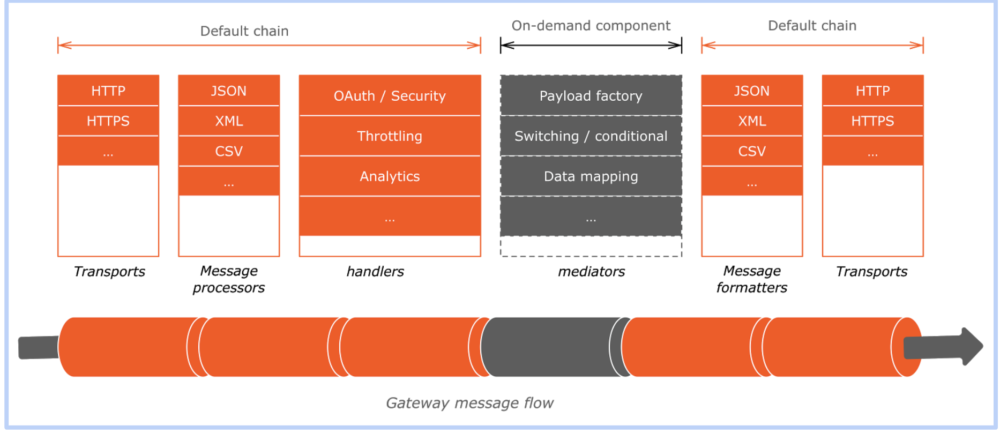

# Overview of the API Gateway

WSO2 API Manager is a fully open-source and is released under [Apache 2.0 License](http://www.apache.org/licenses/LICENSE-2.0.html), one of the most business-friendly licenses available today. It provides Web interfaces for development teams to deploy and monitor APIs, and for consumers to subscribe to, discover and consume APIs through a user-friendly Developer Portal. 

**WSO2 API Gateway** which is powered by [WSO2 EI](https://docs.wso2.com/display/EI650/WSO2+Enterprise+Integrator+Documentation) provides a runtime, backend component (an API proxy) for API calls.
It secures, protects, manages, and scales API calls by intercepting API requests and applying policies such as throttling and security using handlers and managing API statistics.
Upon validation of a policy, the Gateway passes Web service calls to the actual backend. If the service call is a token request, the Gateway passes it directly to the Key Manager.

When the API Manager is running, you can access the Gateway using the URL [https://localhost:9443/carbon](https://localhost:9443/carbon). You integrate a monitoring and analytics component to the API Manager by configuring WSO2 API Manager Analytics. This component provides reports, statistics, and graphs on the APIs deployed in WSO2 API Manager. You can then configure alerts to monitor these APIs and detect unusual activity, manage locations via geolocation statistics and carry out a detailed analysis of the logs.

!!! Info    
    Although the API Gateway contains EI features, it is recommended not to use it for EI-specific tasks. Use it only for Gateway functionality related to API invocations. For example, if you want to call external services like SAP, use a separate EI cluster for that.

**Gateway Architecture**

When an API request first hit to the WSO2 API Gateway it is received by the HTTP/HTTPS `transports`.The transport is responsible for carrying messages that are in a specific format.
Transport provides a receiver, which is used to receive messages, and a sender, which is used to send messages.

Then the receiving transport selects a message builder based on the message's content type. It uses the builder to process the message's raw payload data and convert it into a common XML, which the Gateway mediation engine can then read and understand. The Gateway includes message builders for text-based and binary content.

Then the request is passed through a set of handlers that applies the quality of services on the request message.
further, it enforces security, rate-limiting, and transformations if any on API requests while feeding valuable information of these requests to API Analytics.

After all the request is routed to the backend endpoint.

Conversely, before transport sends a message out from the Gateway, a message formatter is used to build the outgoing stream from the message back into its original format. As with message builders, the message formatter is selected based on the message's content type.

**Main Features**

The Gateway supports the below features to control access and enforce security.

* Supports JWT, OAuth2.0, Basic Auth, API Key, Mutual TLS, and more.
* Restrict API access tokens to domains/IPs.
* Validate APIs payload contents against schemas.
* Apply additional security policies to APIs (authentication and authorization).
* Supports all standard OAuth2.0 grant types and allows extensions and additions to grants.
* Works seamlessly with third-party OAuth2.0 providers, standard, or proprietary.
* Allows blocking subscriptions due to non-payment, API abuse, etc.
* Associate API to system-defined service tiers for quotas and rate-limits.
* Generate JSON web tokens for consumption by back-end servers.
* Leverage XACML for entitlements management and fine-grain authorization.
* Threat protection, bot detection, and token-fraud detection.
* Supports detection of abnormal system use through artificial intelligence and machine learning.
