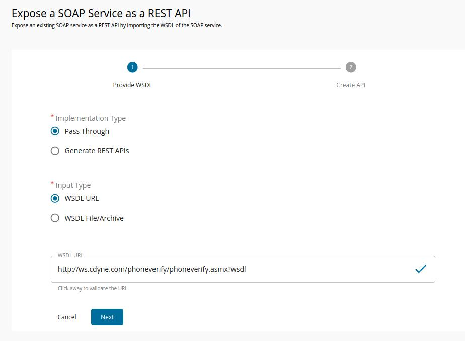
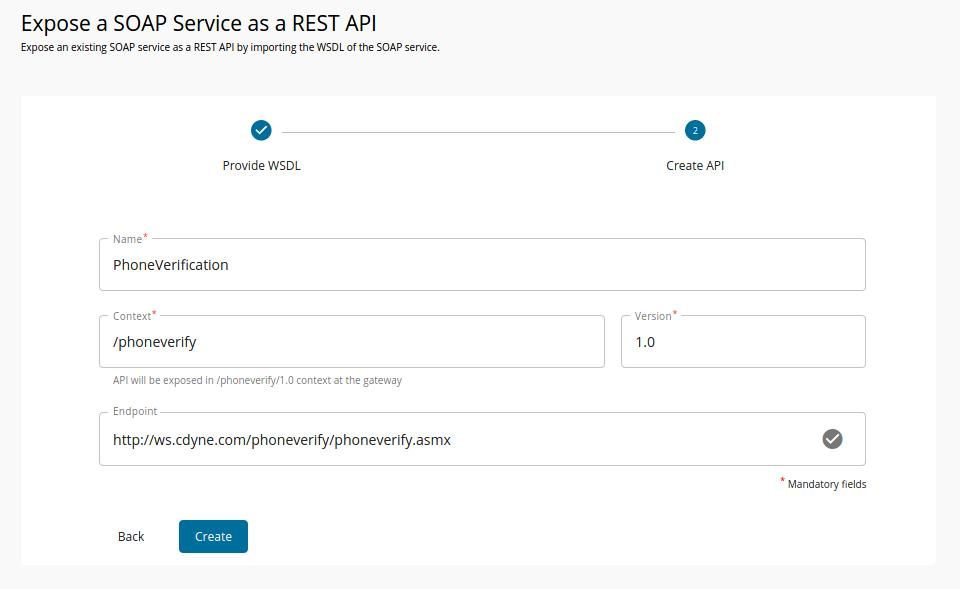
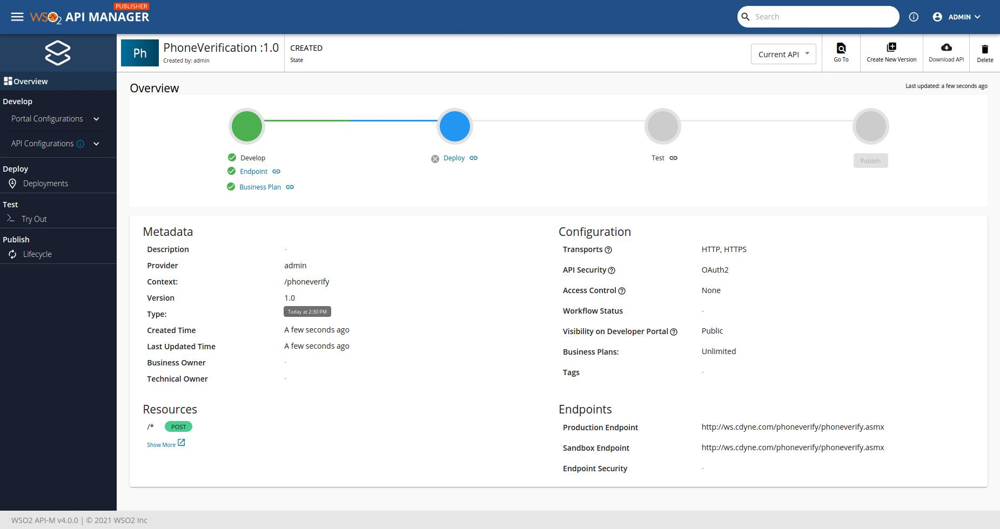
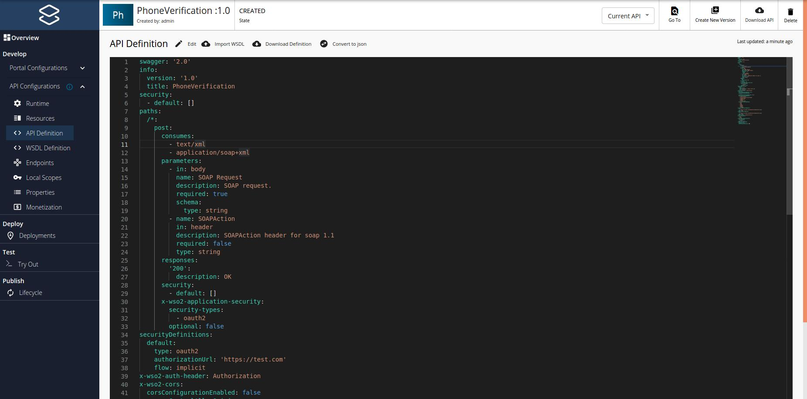
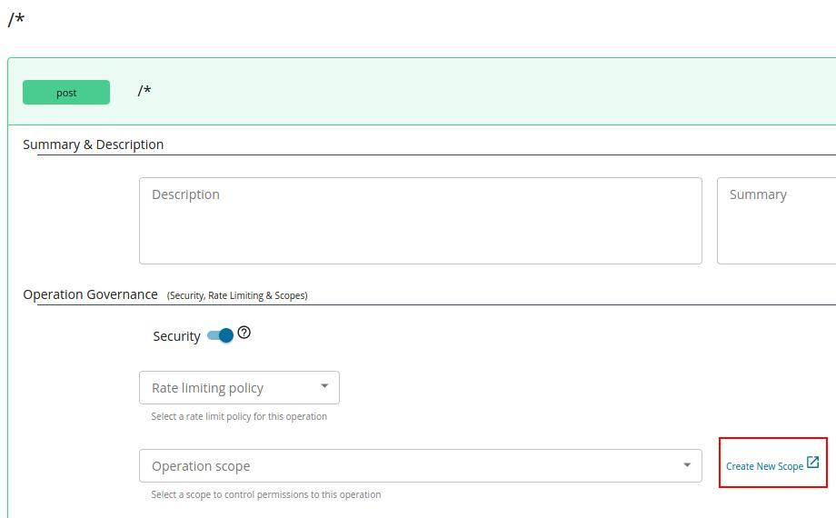
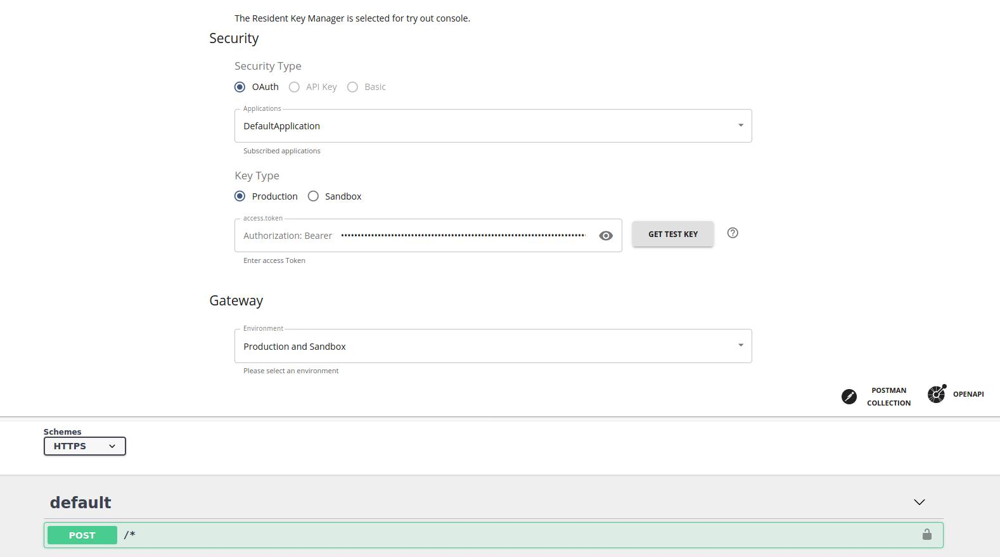
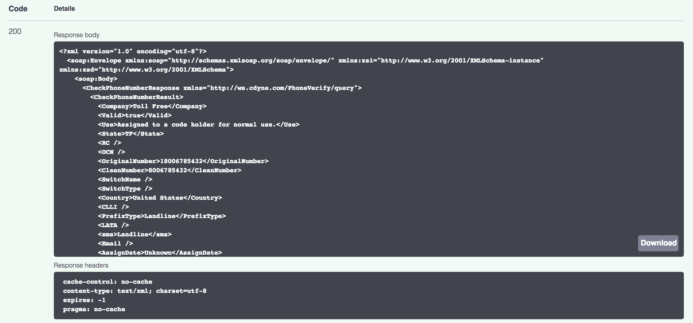

# Expose a SOAP service as a REST API

WSO2 API Manager supports the management of an existing SOAP and WSDL based services exposing as REST APIs.
The organizations who have SOAP/ WSDL based services, can easily bridge their existing services to REST without the cost of a major migration. WSO2 API Manager supports two kinds of services as one for performing a  "pass through" of the SOAP message to the backend and other one is generating [a RESTful api from the backend SOAP service](../../../../learn/design-api/create-api/generate-rest-api-from-soap-backend/).

This tutorial will explain the steps to design, publish and invoke a SOAP service as a RESTful API using **Pass Through**

### Step 1 - Design a SOAP service as a REST API

1.  Sign in to the API Publisher and click **CREATE API**.
      <html>
     
     </html>

2.  Select **Pass Through** option and thereafter, select one of the following options:

     * WSDL URL - If you select this option, you need to provide an endpoint URL.

     * WSDL Archive/File - If you select this option, click Browse and upload either an individual WSDL file or a WSDL archive, which is a WSDL project that has multiple WSDLs.

     <html>

     
Note

     
When uploading a WSDL archive, all the dependent wsdls/xsds that are referred in the parent WSDL file should reside inside the WSDL archive itself. If not, the validation will fail at the point of API creation.

     

     </html>

     This example uses the WSDL `http://ws.cdyne.com/phoneverify/phoneverify.asmx?wsdl` from CDYNE as the endpoint here, but you can use any SOAP backend of your choice.
        

3.  Click **NEXT** button to proceed to the next phase and Provide the information in the table below and click **CREATE** button.

    | Field   | Sample value       |
    |---------|--------------------|
    | Name    | PhoneVerification  |
    | Context | /phoneverify       |
    | Version | 1.0                |
    | Endpoint| http://ws.cdyne.com/phoneverify/phoneverify.asmx|
    | Business Plans| Unlimited|

    

4.  The created API appears in the publisher as follows.
    

5.  API definiton of the Created schema has been displayed at **API Definiton** tab.
     
  
    <html>

Note

    

            If you wish to add scopes to the resources that were created, navigate to ***Resources*** and expand the resources. Thereafter, creating new scopes and specify them under operation scope. If you specify a scope, you need to use the same scope when generating access tokens for the subscribed application to invoke the API. For more information on working with the scopes, see
    [OAuthscopes](../../../../learn/api-security/oauth2/oauth2-scopes/fine-grained-access-control-with-oauth-scopes/)
            

        
</html>   

    
     <html>

     
Note

     
 Note that when creating this API, the default option of **Rate limiting level** , was selected to **API Level**. For more information on setting advanced throttling policies,
     see [Enforce Throttling and Resource Access Policies](../../../../learn/rate-limiting/setting-throttling-limits/).

     

     </html>
     
5.  Navigate to **Life Cycle** and Click **Publish** button.
      You have now published SOAP API at the Developer portal.

### Step 2 - Invoke a SOAP service as a REST API.

1.  Log in to the developer portal, navigate to **Credentials** tab and subscribe to  the api using (e.g.,DefaultApplication)
      

2.  Click the **MANAGE APP** button when prompted **View Credentials**.
    

3.  Click **GENERATED ACCESS TOKEN** and then it propmt popupto create an application access token.
    

5. Click **GENERATE** button, generated JWT token can be seen at the popup and copy it.
     <html>
     
     </html>

    Let's invoke the API.

6. Navigate to **TryOut** tab and paste the token at Access token input field.
    

7. Expand the POST method and click **Try it out** . Enter the following, and click       **Execute** to invoke the API.
      <html>
      <table>
      <tr>
      <td>SOAP Request</td>
       <td>
       <pre>
         <?xml version="1.0" encoding="utf-8"?>
                &lt;soap:Envelope xmlns:xsi="http://www.w3.org/2001/XMLSchema-instance" xmlns:xsd="http://www.w3.org/2001/XMLSchema" xmlns:soap="http://schemas.xmlsoap.org/soap/envelope/"&gt;
                &lt;soap:Body&gt;
                    &lt;CheckPhoneNumber xmlns="http://ws.cdyne.com/PhoneVerify/query"&gt;
                    &lt;PhoneNumber&gt;18006785432&lt;/PhoneNumber&gt;
                    &lt;LicenseKey&gt;18006785432&lt;/LicenseKey&gt;
                    &lt;/CheckPhoneNumber&gt;
                &lt;/soap:Body&gt;
            &lt;/soap:Envelope&gt;
      </pre>
      </td>
      </tr>
      <tr>
      <td>SOAP Action
      </td>
      <td>
      <pre>
      http://ws.cdyne.com/PhoneVerify/query/CheckPhoneNumber
      </pre>
      </td>
      </tr>
      </table>
      </html>

    

8.  Note the API response that appears on the console.
    <html>

     
Note

     
You can also invoke this API using a third-party tool such as SOAP UI. For more information on how to invoke an API using a SOAP client, 
     see [Invoke an API using a SOAP Client](../../../../learn/consume-api/invoke-apis/invoke-apis-using-tools/invoke-an-api-using-a-soap-client/) .

     

     </html>

